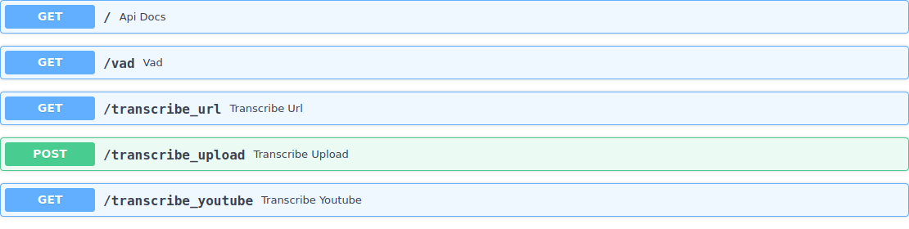
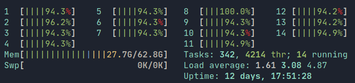
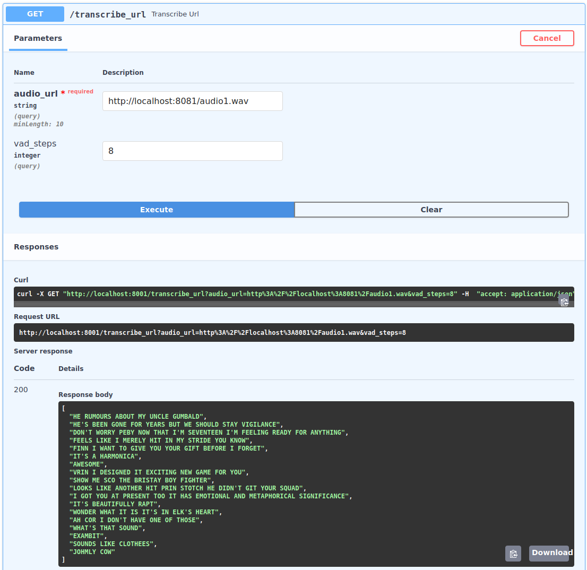

# Hugging Face Wav2Vec2 Demonstration API

1. Install [poetry](https://python-poetry.org/docs/) - a python dependency manager
2. `poetry install`
3. `poetry run python main.py`
4. Pop open your browser to [http://localhost:8001/](http://localhost:8001/) for the docs.

### Resource Warning - this will use all your cores!

### Youtube Transcribe Example
Used the following video: https://www.youtube.com/watch?v=dZ7GiP4vPts
See output transcript under `readme_assets/example_youtube_output.json`

### URL Transcribe
If you have some wavs locally spin up a local file server with `python -m http.server 8081` and supply a local url to the transcribe_url endpoint like so:

### File Transcribe
Just upload the file to the transcribe_file endpoint!

