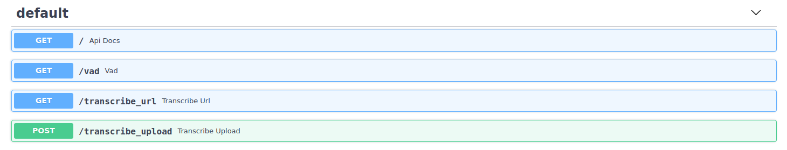
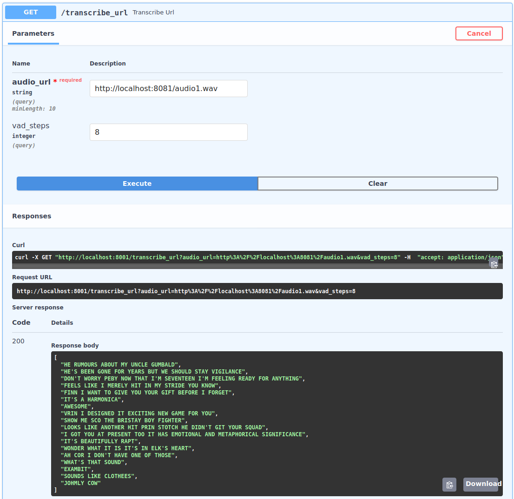

# Hugging Face Wav2Vec2 Demonstration API

1. Install [poetry](https://python-poetry.org/docs/) - a python dependency manager
2. `poetry install`
3. `poetry run python main.py`

If you have some wavs locally spin up a local file server with `python -m http.server 8081` and supply a local url to the transcribe_url endpoint like so:

or just upload the file to the transcribe_file endpoint.